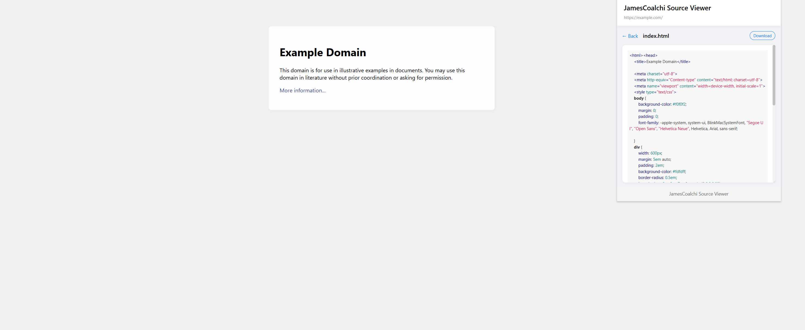

# JamesCoalchi Source Viewer

A Chrome extension that allows you to view, download, and search source code files on almost any website (excluding websites Chrome extensions don't have access to).

## Features

- **View Source Code**: Easily browse HTML, CSS, JavaScript, and other resources from any website
- **Syntax Highlighting**: Code is displayed with proper syntax highlighting for better readability
- **File Filtering**: Filter files by type (HTML, CSS, JavaScript, Images, Other)
- **Search Functionality**: Search for specific files
- **Download Options**: Download individual files or the entire source code as a ZIP archive
- **Resource Categorization**: Automatically categorizes different types of web resources

## Installation

### Manual Installation (Developer Mode)

1. Download or clone this repository
2. Open Chrome and navigate to `chrome://extensions/`
3. Enable "Developer mode" in the top-right corner
4. Click "Load unpacked" and select the extension directory
5. The extension should now be installed and visible in your toolbar

## How to Use

1. Visit any website you want to analyze
2. Open the extension
3. The extension will scan and display all available resources from the website
4. Use the category buttons to filter resources by type
5. Use the search bar to find specific files
6. Click "View" to see the content of a file with syntax highlighting
7. Click "Download" to save an individual file
8. Click "Download All" to save all files as a ZIP archive

## Screenshots

## Technologies Used

- **JavaScript**: Core functionality and DOM manipulation
- **HTML/CSS**: Modern, responsive UI with a clean design
- **Chrome Extension API**: For accessing tab information and executing scripts
- **[JSZip](https://stuk.github.io/jszip/)**: For creating and downloading ZIP archives of all website resources
- **[highlight.js](https://highlightjs.org/)**: For syntax highlighting of code files (HTML, CSS, JavaScript)

## Privacy

This extension only accesses resources from the website you're currently visiting. It does not collect or transmit any personal data.

## License

[MIT License](LICENSE)